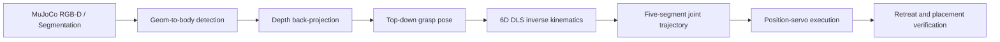

# Embodied AI Pick-and-Place · MuJoCo + Franka FR3

一个从场景建模、视觉定位、抓取规划到闭环验证的机械臂仿真项目。系统在
MuJoCo 中驱动 Franka FR3 完成桌面物体抓取与定点放置，并提供可复现的随机
工况评估数据。


## 项目结果

| 指标 | 结果 | 口径 |
| --- | ---: | --- |
| 随机工况成功率 | **53 / 60（88.3%）** | 固定种子，成功需完成检测、定位、规划、执行并进入 5 cm 放置区 |
| 成功率 Wilson 95% CI | **77.8%–94.2%** | 二项分布区间估计 |
| 定位 XY 误差 | **中位 2.59 mm / P95 4.47 mm** | 深度反投影结果与仿真真值比较 |
| 成功样本放置误差 | **中位 8.44 mm / P95 24.69 mm** | 物体中心与放置区中心的 XY 距离 |
| 基准任务轨迹 | **250 个关节路点** | 5 段轨迹，每段 50 点 |

原始 CSV、汇总 JSON 和图表见 [`docs/evaluation/`](docs/evaluation/)，完整方法、
失败样本和 Sim-to-Real 方案见
[`项目技术报告`](docs/Franka_FR3机械臂项目技术报告.pdf)。

## 系统流程



核心设计：

- 感知：使用仿真分割标签提取目标区域，再通过深度图、相机内外参恢复世界坐标。
- 规划：对预抓取、抓取、抬升、转运和放置 5 个路点执行带阻尼最小二乘 IK。
- 执行：通过 position actuator 跟踪插值轨迹，保留动力学与接触过程。
- 安全：放置后先垂直抬升，再回 home，避免夹爪横向扫动物体。
- 验证：目标必须仍能被定位、离开初始位置且进入设定放置区；不可见不会被判为成功。

## 快速开始

建议使用 Python 3.10 或 3.11。

```bash
python -m venv .venv
source .venv/bin/activate
python -m pip install --upgrade pip
pip install -r requirements.txt
python main.py --target cube_red
```

macOS 需要可视化窗口时：

```bash
mjpython main.py --target cube_red --viewer
```

Linux 无头环境可设置 `MUJOCO_GL=egl`。命令行支持四个目标：`cube_red`、
`cube_blue`、`cyl_green` 和 `sphere_yellow`。

## 测试与评估

安装开发依赖并运行快速测试：

```bash
pip install -r requirements-dev.txt
pytest -q -m "not integration"
ruff check .
```

完整基准任务：

```bash
pytest -q -m integration
```

复现随机工况评估（默认固定种子、60 次）：

```bash
python -m scripts.evaluate_randomized --trials 60
```

运行结果写入未纳入版本控制的 `artifacts/evaluation/`。仓库中的
`docs/evaluation/` 是技术报告所引用的冻结证据集。

## 项目结构

```text
.
├── control/                 # 状态机、执行与结果验证
├── perception/              # 仿真相机、检测和三维定位
├── planning/                # 抓取姿态和关节轨迹规划
├── robot/                   # FR3 模型、IK、机械臂和夹爪接口
├── simulation/              # 场景加载与仿真步进
├── tests/                   # 单元测试和端到端测试
├── scripts/                 # 随机工况评估工具
├── docs/                    # 技术报告、图表与冻结评估数据
└── main.py                  # 单次抓取放置入口
```

## 已知边界与 Sim-to-Real

这是仿真验证项目，不宣称已经完成实机部署：

- 当前检测使用 MuJoCo ground-truth segmentation，不是训练后的视觉模型。
- 当前策略是解析式任务流程与 DLS IK，不包含强化学习、VLA 或训练曲线。
- 随机评估中的 7 次失败均发生在工作空间内侧边界，原因是锁姿态 IK 不可达。
- 实机迁移仍需接入 RGB-D 相机标定、真实检测器、机器人驱动、安全 PLC/急停、
  碰撞约束与分阶段现场验收。

代码已经为真实检测器保留适配入口；更完整的风险分层、接口映射和验收指标见技术报告。

## 许可证

原创代码与文档采用“保留所有权利”的作品集评审许可，见 [`LICENSE`](LICENSE)。
Franka FR3 模型和资产采用其原许可证，见
[`THIRD_PARTY_NOTICES.md`](THIRD_PARTY_NOTICES.md) 与
[`robot/franka_fr3/LICENSE`](robot/franka_fr3/LICENSE)。
