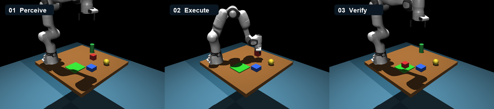
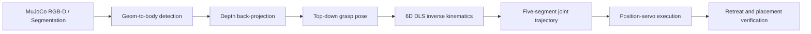
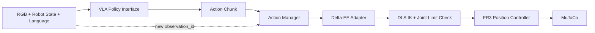

# Embodied AI Pick-and-Place · MuJoCo + Franka FR3

一个从场景建模、视觉定位、抓取规划到闭环验证的机械臂仿真项目。系统在
MuJoCo 中驱动 Franka FR3 完成桌面物体抓取与定点放置，并提供可复现的随机
工况评估数据。



## 项目结果

| 指标 | 结果 | 口径 |
| --- | ---: | --- |
| 随机工况成功率 | **53 / 60（88.3%）** | 固定种子，成功需完成检测、定位、规划、执行并进入 5 cm 放置区 |
| 成功率 Wilson 95% CI | **77.8%–94.2%** | 二项分布区间估计 |
| 定位 XY 误差 | **中位 2.59 mm / P95 4.47 mm** | 深度反投影结果与仿真真值比较 |
| 成功样本放置误差 | **中位 8.44 mm / P95 24.69 mm** | 物体中心与放置区中心的 XY 距离 |
| 基准任务轨迹 | **250 个关节路点** | 5 段轨迹，每段 50 点 |

原始 CSV、汇总 JSON 和图表见 [`docs/evaluation/`](docs/evaluation/)，完整方法、
失败样本和 Sim-to-Real 方案见
[`项目技术报告`](docs/Franka_FR3机械臂项目技术报告.pdf)。

## 系统流程



核心设计：

- 感知：使用仿真分割标签提取目标区域，再通过深度图、相机内外参恢复世界坐标。
- 规划：对预抓取、抓取、抬升、转运和放置 5 个路点执行带阻尼最小二乘 IK。
- 执行：通过 position actuator 跟踪插值轨迹，保留动力学与接触过程。
- 安全：放置后先垂直抬升，再回 home，避免夹爪横向扫动物体。
- 验证：目标必须仍能被定位、离开初始位置且进入设定放置区；不可见不会被判为成功。

## 快速开始

建议使用 Python 3.10 或 3.11。

```bash
python -m venv .venv
source .venv/bin/activate
python -m pip install --upgrade pip
pip install -r requirements.txt
python main.py --target cube_red
```

macOS 需要可视化窗口时：

```bash
mjpython main.py --target cube_red --viewer
```

Linux 无头环境可设置 `MUJOCO_GL=egl`。命令行支持四个目标：`cube_red`、
`cube_blue`、`cyl_green` 和 `sphere_yellow`。

## 仓储分拣规划与执行

仓储扩展先将任务规划与机器人运动控制解耦。规划器只输出经过白名单校验的
`scan / relocate / pick / place / verify` 任务序列，不接收或生成关节角、力矩和
轨迹。

| 工程验证 | 结果 | 说明 |
| --- | ---: | --- |
| 约束规划器复杂场景 | **5 / 5** | 固定种子、初始位置扰动，每次均完成腾挪和双物体归位 |
| 本地 `qwen2.5:7b` 功能样本 | **2 / 2** | 仅验证闭环可运行，不作为模型可靠性结论 |
| Ollama 计划校验拒绝 | **3 / 9（33.3%）** | 不安全或不合规计划未进入执行器 |
| 最终放置误差 | **最大 8.60 mm** | 上述成功试次中物体中心到目标中心的 XY 距离 |

冻结的逐次数据、汇总结果和口径说明见
[`docs/evaluation/warehouse_agent_evaluation.md`](docs/evaluation/warehouse_agent_evaluation.md)。

### 任务计划与预执行

使用确定性规则规划器查看完整计划：

```bash
python warehouse_demo.py --planner rule
```

本机启动 Ollama 后，可让本地模型根据自然语言任务生成同一结构的计划：

```bash
ollama serve
python warehouse_demo.py --planner ollama --model qwen2.5:14b \
  --objects cube_red cube_blue \
  --task "只分拣红色和蓝色货物，并逐件确认库位"
```

当前命令只生成和校验计划，不驱动机械臂。任务配置位于
[`warehouse/configs/warehouse_sorting.json`](warehouse/configs/warehouse_sorting.json)。

使用独立双库位场景生成无运动预执行清单：

```bash
python warehouse_preview.py
```

该命令加载真实 MuJoCo 模型，将通过校验的任务计划编译为 `body_id + place_xy`
控制请求，但不会创建 Controller 或驱动机械臂。最小双货物任务配置位于
[`warehouse/configs/warehouse_sorting_minimal.json`](warehouse/configs/warehouse_sorting_minimal.json)。

执行已验证的红色或蓝色货物单件抓放（命令会推进 MuJoCo 仿真）：

```bash
python warehouse_run.py --object cube_red
python warehouse_run.py --object cube_blue
```

两条命令分别在全新场景中验证抓取、放置与闭环校验；结果包含目标可见性、
移动距离、放置误差及对应判定阈值。

### 批任务、故障策略与复杂场景

在同一个场景和 Controller 中连续执行红蓝分拣：

```bash
python warehouse_batch_run.py
```

批次入口首先通过相机、检测器和定位器生成 `initial_state`，规划器只处理其中
“可见且尚未进入指定库位”的货物。执行结束后重新生成 `final_state`，只有计划
执行成功且所有货物都被观测到位时，`goal_satisfied` 才为 `true`。状态快照包含
货物位置、可见性、目标距离、库位占用以及待处理/完成/缺失清单。

批任务按红色、蓝色顺序执行并逐件复检。失败结果包含稳定的 `failure_code` 与
`failed_state`：目标缺失触发一次 `rescan`，执行失败触发一次 `retry_once`，
规划/可达性失败执行 `skip_and_report` 并继续下一件，复检失败执行 `stop`。
未配置的失败码和已耗尽的恢复动作默认停止。

每件货物的结果包含 `disposition`、`policy_actions` 和完整 `attempts`。重新尝试时
会从当前仿真状态再次感知并规划，而不是复用上一轮轨迹；诊断原文保留在
`error_message`。

使用可控故障注入验证四种处置策略：

```bash
python warehouse_fault_demo.py --failure object_missing
python warehouse_fault_demo.py --failure pick_failed
python warehouse_fault_demo.py --failure ik_failed
python warehouse_fault_demo.py --failure verification_failed
```

故障包装器只拦截指定货物的一次 Controller 调用，不修改 MuJoCo 物理状态，
其他调用继续使用同一套运行时模块。输出中的 `policy_verified` 表示策略行为是否
符合场景配置；`skip_and_report` 和 `stop` 演示的任务结果按定义为失败。

运行目标库位被占用的复杂任务：

```bash
python warehouse_complex_run.py
```

独立复杂场景中，蓝色货物初始占用红色货物的优先库位。约束规划器根据动态
占用状态插入 `relocate`，依次执行“蓝色移到缓存位 → 红色入优先库位 → 蓝色入
标准库位”。`goal_satisfied` 同时要求执行成功、两个货物到达各自目标库位、确实
执行过搬移动作且缓存位最终为空。

### 本地模型闭环与评估

使用本地 Ollama 运行“观察—规划—单动作执行—再观察”的闭环 Agent：

```bash
ollama serve
python warehouse_agent_run.py --model qwen2.5:14b
```

模型每轮接收最新场景快照和上一轮高层执行结果，输出剩余任务计划；系统只执行
首个 `relocate` 或 `pick-place-verify` 周期，随后重新观测并再次规划。模型输出必须
通过 JSON Schema、任务协议和动态库位占用校验，且不能包含关节角、力矩、速度或
轨迹。确定性执行器继续负责重试、停止策略和底层机械臂控制；连续两轮无状态进展
时 Agent 自动终止，避免空转。

使用固定种子和初始位置扰动批量评估闭环 Agent：

```bash
python warehouse_agent_evaluate.py --planner constraint --trials 5
python warehouse_agent_evaluate.py --planner ollama --model qwen2.5:7b --trials 3
```

评估报告将全部试次（包括运行环境错误）纳入成功率分母，并输出 Wilson 95% 置信
区间、规划请求/拒绝/修订比例、动作轮次、仿真与墙钟耗时、终止原因、失败码以及
成功试次的最终放置误差分布。逐次 CSV 和汇总 JSON 默认写入未纳入版本控制的
`artifacts/agent_evaluation/<planner>/`，便于保留并比较不同规划器结果。

## VLA Action-Chunk Runtime（Phase 1A）

该阶段先验证 VLA 动作如何接入现有 FR3 控制链，不训练或加载真实 VLA 模型。
系统把相机图像、机器人状态和语言指令封装为带序号的观测；确定性模拟策略输出
末端增量动作块，Runtime 再逐步转换并执行：



已实现的运行时能力：

- 观测契约：只读 RGB、7 维关节位置/速度、末端位姿、夹爪状态与语言子目标。
- 动作契约：世界坐标系下的末端位置/旋转增量，以及可选夹爪开合命令。
- 动作适配：增量限幅、工作空间检查、DLS IK 和 FR3 关节限位校验。
- 动作管理：按序消费动作块，拒绝过期观测产生的动作，并在单步动作结束后安全抢占。
- 异步策略接口：模拟推理延迟不会阻塞控制线程，返回结果保留请求与观测序号。

运行确定性抢占演示：

```bash
python vla_runtime_demo.py
```

演示先执行旧动作块的第一个动作，再注入新观测；旧动作块剩余两个动作被取消，
随后执行新动作块的两个动作。输出包含完整事件序列，可用于核对激活、分发、取消
和完成边界。这里的 `ScriptedPolicy` 仅用于验证 Runtime，不代表模型推理效果。

## 测试与评估

安装开发依赖并运行快速测试：

```bash
pip install -r requirements-dev.txt
pytest -q -m "not integration"
ruff check .
```

完整基准任务：

```bash
pytest -q -m integration
```

复现随机工况评估（默认固定种子、60 次）：

```bash
python -m scripts.evaluate_randomized --trials 60
```

运行结果写入未纳入版本控制的 `artifacts/evaluation/`。仓库中的
`docs/evaluation/` 是技术报告所引用的冻结证据集。

## 项目结构

```text
.
├── control/                 # 状态机、执行与结果验证
├── perception/              # 仿真相机、检测和三维定位
├── planning/                # 抓取姿态和关节轨迹规划
├── robot/                   # FR3 模型、IK、机械臂和夹爪接口
├── simulation/              # 场景加载与仿真步进
├── tests/                   # 单元测试和端到端测试
├── warehouse/               # 仓储场景配置、任务协议和本地规划器
├── vla_runtime/             # VLA 观测、动作块、适配与可抢占执行接口
├── scripts/                 # 随机工况评估工具
├── docs/                    # 技术报告、图表与冻结评估数据
├── warehouse_preview.py     # 仓储任务无运动预执行入口
├── warehouse_run.py         # 仓储场景单件抓放入口
├── warehouse_batch_run.py   # 共享场景红蓝连续分拣入口
├── warehouse_fault_demo.py  # 可控故障与恢复策略演示入口
├── warehouse_complex_run.py # 库位占用与搬移任务入口
├── warehouse_agent_run.py   # Ollama 观察—规划—执行闭环入口
├── warehouse_agent_evaluate.py # Agent 固定种子批评估入口
├── vla_runtime_demo.py      # 动作块抢占与重规划演示入口
└── main.py                  # 单次抓取放置入口
```

## 已知边界与 Sim-to-Real

这是仿真验证项目，不宣称已经完成实机部署：

- 当前检测使用 MuJoCo ground-truth segmentation，不是训练后的视觉模型。
- 当前动作策略仍是解析式流程或确定性模拟策略；已具备 VLA Runtime 接口，但未接入
  真实 VLA 权重、强化学习或训练曲线。
- 随机评估中的 7 次失败均发生在工作空间内侧边界，原因是锁姿态 IK 不可达。
- 实机迁移仍需接入 RGB-D 相机标定、真实检测器、机器人驱动、安全 PLC/急停、
  碰撞约束与分阶段现场验收。

代码已经为真实检测器保留适配入口；更完整的风险分层、接口映射和验收指标见技术报告。

## 许可证

原创代码与文档采用“保留所有权利”的作品集评审许可，见 [`LICENSE`](LICENSE)。
Franka FR3 模型和资产采用其原许可证，见
[`THIRD_PARTY_NOTICES.md`](THIRD_PARTY_NOTICES.md) 与
[`robot/franka_fr3/LICENSE`](robot/franka_fr3/LICENSE)。
